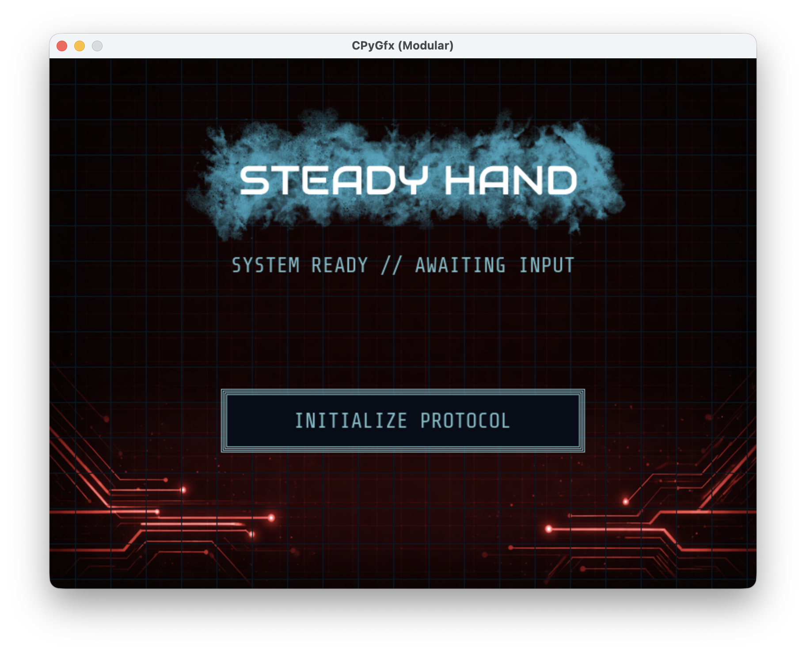
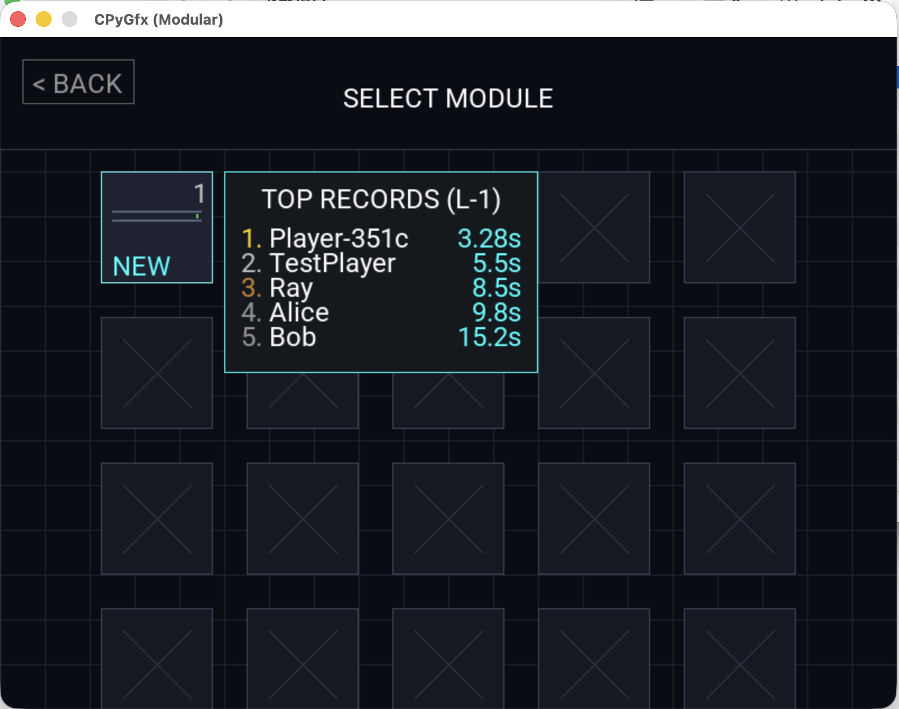
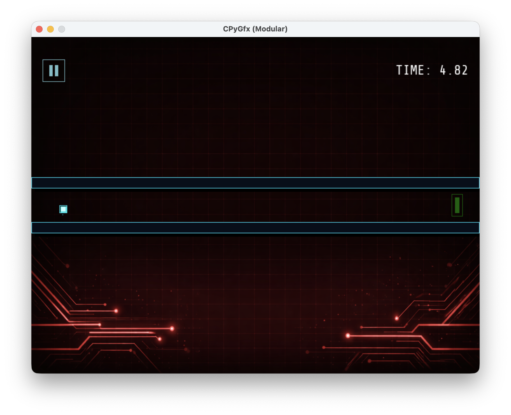
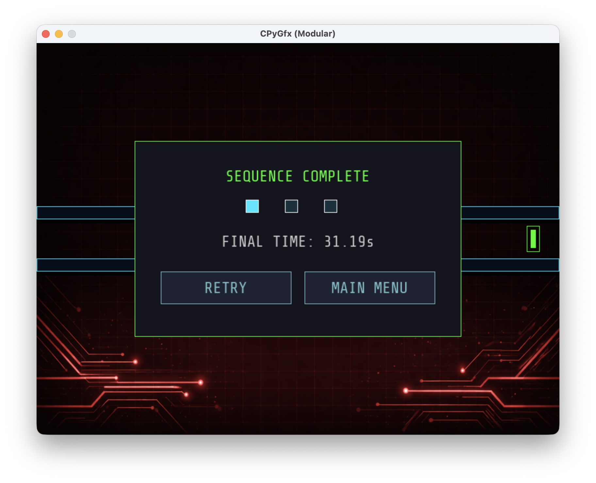

# SteadyHand

SteadyHand is a precision-based puzzle platformer developed using a custom technology stack. The project demonstrates a full-cycle implementation of a game engine, client-side logic, and a custom backend infrastructure without relying on high-level game frameworks or web frameworks.

This repository contains the game client and the backend server logic. The graphics engine is maintained in a separate repository: [CPyGfx](https://github.com/rayhuang2006/CPyGfx).

## Visual Overview

| Main Menu | Level Selection |
| :---: | :---: |
|  |  |
| **System Ready** | **Real-time Leaderboard** |

| Gameplay | Sequence Complete |
| :---: | :---: |
|  |  |
| **Precision Movement** | **Data Upload** |

## Technical Architecture

The project is structured into three distinct layers, highlighting expertise in system design and low-level implementation.

### 1. Graphics Engine (CPyGfx)
* **Repository:** [rayhuang2006/CPyGfx](https://github.com/rayhuang2006/CPyGfx)
* **Core:** Written in C, interfacing directly with SDL2 for hardware acceleration.
* **Binding:** Exposed to Python via `ctypes` for manual memory management and pointer handling.
* **Features:** Custom texture rendering, TTF font support, and raw input polling.

### 2. Networking & Protocol (SHNS)
* **Transport:** Pure TCP Socket programming (Python `socket` module).
* **Protocol:** Custom binary application-layer protocol (SHP).
    * Structure: `[CMD (1 byte)] [LENGTH (4 bytes)] [PAYLOAD (JSON encoded bytes)]`.
    * Ensures data integrity and handles packet fragmentation.
* **Concurrency:** Client-side utilizes threading for non-blocking asynchronous data transmission (uploading scores/fetching leaderboards).

### 3. Database Engine
* **Storage:** Proprietary binary file format (`.db`). No SQL or external database engines (like SQLite) are used.
* **Logic:** Implements direct file I/O operations using Python's `struct` module for packing/unpacking C-style data structures.
* **Performance:** Optimized for fixed-length record appending and reading.

## Installation & Setup

Since this project depends on the custom `CPyGfx` engine, the installation process involves two steps.

### Prerequisites
* Python 3.10+
* SDL2 Development Libraries (Required for compiling CPyGfx)

**macOS:**
```bash
brew install pkg-config sdl2 sdl2_ttf sdl2_image
````

**Linux (Ubuntu/Debian):**

```bash
sudo apt-get update
sudo apt-get install libsdl2-dev libsdl2-image-dev libsdl2-ttf-dev python3-dev
```

### Step 1: Install the Engine (CPyGfx)

First, clone and install the graphics engine.

```bash
git clone https://github.com/rayhuang2006/CPyGfx.git
cd CPyGfx
```

Follow the instructions on this repository to set up your virtual environment, then navigate to the folder where you want to begin setting it up.

### Step 2: Install the Game (SteadyHand)

Clone this repository.

```bash
git clone https://github.com/rayhuang2006/SteadyHand.git
cd SteadyHand
```

### Step 3: Network Configuration

Create a `.env` file in the root directory of `SteadyHand` to configure the connection.

**For Local Development (Server and Client on the same machine):**

```ini
SERVER_HOST=127.0.0.1
SERVER_PORT=9999
```

## Usage

To utilize the full functionality (including the global leaderboard), you must run the server application first.

### 1\. Start the Server

The server will initialize the binary database and listen for TCP connections.

```bash
python3 server/main.py
```

### 2\. Start the Game Client

Open a new terminal window and run the game.

```bash
python3 main.py
```

## Controls

  * **Mouse**: Navigate menus and interface interactions.
  * **W / A / S / D**: Control the player movement.
  * **ESC**: Pause game / Return to the previous menu.
  * **ENTER**: Confirm actions / Retry level.

## License

This project is available for educational and demonstration purposes.